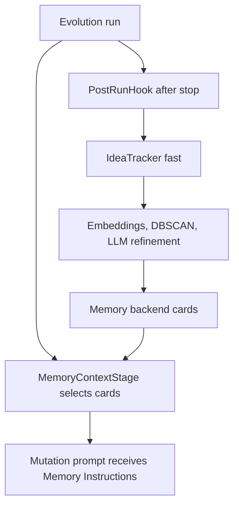

# Memory Mechanism With IdeaTracker Fast

This document explains how GigaEvo's memory mechanism works when the fast
IdeaTracker configuration is used. It focuses on the runtime path that reads
memory during mutation and the post-run path that writes new memory cards.

For the full memory reference, see `docs/memory.md`. For the backend module map,
see `docs/MEMORY_ARCHITECTURE.md`.

## Short Version

Memory is split into two independent paths:

- During evolution, `MemoryContextStage` asks a `MemoryProvider` for relevant
  memory cards and adds them to the mutation prompt as `Memory Instructions`.
- After evolution stops, `IdeaTracker` runs as a `PostRunHook`, extracts useful
  ideas from successful programs, and writes selected ideas back to the memory
  backend.

With `config/ideas_tracker/fast.yaml`, the write path uses batch embeddings,
DBSCAN clustering, and concurrent LLM refinement instead of processing each
program one by one.



## Read Path: Memory During Mutation

The read path is part of the program DAG. `MemoryContextStage` is always present,
but the injected provider controls whether it does real work:

- `NullMemoryProvider` returns no cards and makes memory a no-op.
- `SelectorMemoryProvider` lazily creates a `MemorySelectorAgent` and retrieves
  relevant cards from the configured backend.

For each program, `MemoryContextStage.compute()` calls:

```text
provider.select_cards(program, task_description, metrics_description)
```

If cards are returned, the stage:

1. Stores the selected card IDs in program metadata under
   `memory_selected_idea_ids`.
2. Joins the selected card text into a single string.
3. Passes that string to `MutationContextStage`.

`MemoryMutationContext.format()` then inserts the cards into the mutation context
under a `## Memory Instructions` heading. The LLM mutation agent sees these ideas
next to the parent code, metrics, insights, and lineage context.

## Write Path: IdeaTracker Fast After A Run

`IdeaTracker` is a `PostRunHook`. `EvolutionEngine.run()` calls
`post_run_hook.on_run_complete(storage)` in its `finally` block, so the tracker
runs after the evolution loop exits.

The core write sequence is:

1. Load all stored programs from `ProgramStorage`.
2. Optionally aggregate memory usage updates from programs that used selected
   cards during mutation.
3. Filter out roots, non-positive-fitness programs, and duplicates.
4. Convert remaining programs to `ProgramRecord` objects.
5. Run the fast analyzer pipeline.
6. Enrich, log, and write selected ideas to the memory backend.

The fast analyzer is implemented by `IdeaAnalyzerFast`. It flattens each
program's improvements into embedding cards, computes sentence-transformer
embeddings, clusters similar ideas with DBSCAN, refines clusters with concurrent
LLM calls, and emits extended idea records.

Compared with the default analyzer, the fast path is designed for larger runs:
it groups similar improvements first, then asks the LLM to refine representative
idea clusters.

## Fast Configuration

The fast preset lives in `config/ideas_tracker/fast.yaml`. The important settings
are:

```yaml
ideas_tracker:
  analyzer_type: fast
  analyzer_fast_settings:
    embeddings_model: sentence-transformers/all-mpnet-base-v2
    batch_size: 32
    min_samples_for_dbscan: 4
    dbscan_eps: 0.25
    dbscan_min_samples: 2
    refine_subgroup_size: 20
    llm_max_concurrent: 100
  postprocessing_type: fast
  record_conversion_type: fast
  memory_write_enabled: true
  memory_usage_tracking_enabled: true
  checkpoint_dir: ${checkpoint_dir}
  namespace: ${namespace}
  redis_prefix: ${problem.name}
```

The `analyzer_fast_settings` block controls the clustering and LLM refinement
behavior. `memory_write_enabled` controls whether final ideas are pushed into the
memory backend. `memory_usage_tracking_enabled` controls whether card usage and
fitness deltas are merged back into idea banks.

## Usage Tracking

The read and write paths are connected through metadata. When memory cards are
selected for a parent program, their IDs are stored on that program. Later, when
mutations are generated and evaluated, the tracker can compare child fitness
against parent fitness and attribute per-use deltas to the selected card IDs.

Those usage updates are logged and can be merged into the idea banks before the
memory write pipeline runs. This lets the backend retain both the idea text and
evidence about how often the idea was used and whether it helped.

## Typical Workflow

A common workflow uses two runs:

```bash
# Run A: build memory cards after evolution completes
python run.py \
  problem.name=heilbron \
  ideas_tracker=fast \
  memory=none \
  checkpoint_dir=outputs/memory_bank_01 \
  namespace=review_bank

# Run B: read those cards during mutation
python run.py \
  problem.name=heilbron \
  memory=local \
  checkpoint_dir=outputs/memory_bank_01 \
  namespace=review_bank
```

The same `checkpoint_dir` and `namespace` should be used when a later run reads
from the bank produced by the tracker.

## Key Files

- `config/ideas_tracker/fast.yaml`: Hydra preset for the fast tracker.
- `gigaevo/programs/stages/memory_context.py`: selects cards during the DAG run.
- `gigaevo/memory/provider.py`: provider abstraction for no-op and selector-backed memory.
- `gigaevo/evolution/mutation/context.py`: formats memory cards for mutation prompts.
- `gigaevo/evolution/engine/core.py`: calls the post-run hook after the engine stops.
- `gigaevo/memory/ideas_tracker/ideas_tracker.py`: filters programs, runs analysis, logs, and writes memory.
- `gigaevo/memory/ideas_tracker/components/analyzer_f.py`: fast embedding, clustering, and LLM refinement pipeline.
- `gigaevo/memory/ideas_tracker/components/memory_pipeline.py`: writes selected ideas into the memory backend.

## Notes

- The memory backend is separate from the MAP-Elites or island archive used by
  evolution strategies. The archive stores programs; memory stores idea cards.
- The fast analyzer requires `sentence-transformers` and `scikit-learn`.
- API-backed and local memory use the same high-level read/write flow; backend
  details are controlled by `config/memory_backend.yaml` and runtime overrides.
